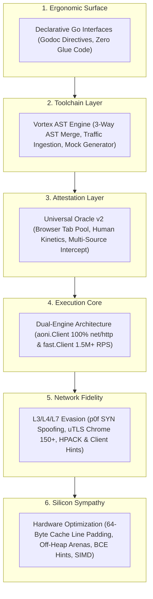
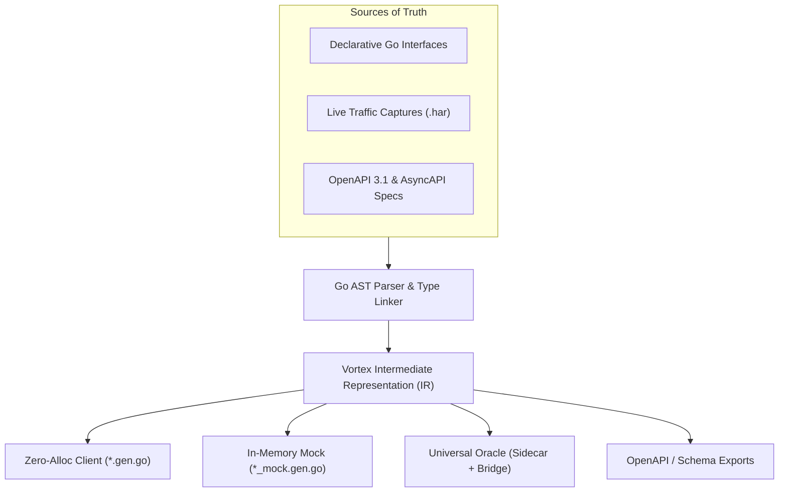
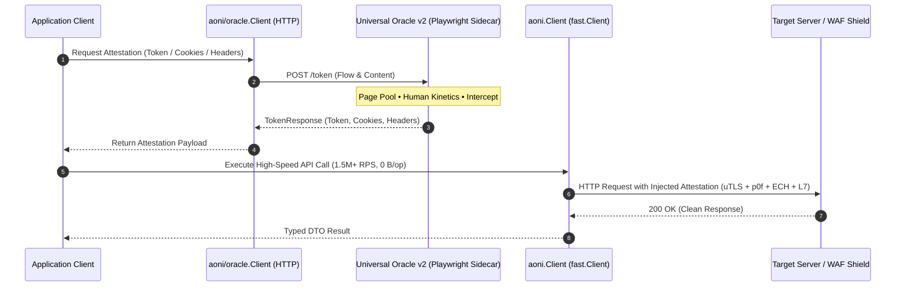

# Vortex — Zero-Allocation AST Toolchain & Sovereign Contract Engine

`vortex` is the unified declarative contract toolchain, code generator, and traffic-driven reverse engineering suite for `aoni`. It operates directly on Go Abstract Syntax Trees (AST), treating idiomatic Go interface declarations as the single source of truth for REST, WebSocket, SSE, OpenAPI 3.1, AsyncAPI 2.x/3.x, and Protocol Buffer communications.

## 1. The Vortex Manifesto: The "Apple of the Web" & Sovereign Clients

> *"A little copying is better than a little dependency."* — Go Proverb

### The Industry Crisis: The Fragmented "Android/PC" Anti-Pattern

For over two decades, network client development in backend software engineering has suffered from deep structural dysfunction. Developers assemble fragile Frankensteins out of disconnected open-source libraries:
* Standard `net/http` is wrapped in an unmaintained third-party TLS fork to bypass basic bot filters.
* Brittle headless browser scripts (Puppeteer or Playwright) are cobbled together to solve JavaScript challenges, consuming gigabytes of RAM and collapsing under even modest concurrency.
* Heavy, reflection-based third-party SDKs are imported into the dependency graph, dragging in hundreds of transitive packages, memory leaks, and breaking upgrade cycles.
* When upstream platforms (such as Google, Discord, Telegram, or Steam) update an internal endpoint, add a field, or change cryptographic signing tokens, developers find themselves blocked for weeks waiting for external library maintainers.

This fragmented model produces slow, unmaintainable, and vulnerable software. Memory is wasted on intermediate allocations (`map[string]any`, runtime reflection descriptors, and unbuffered string concatenations), garbage collection spikes cause latency jitter, and WAF systems easily intercept artificial fingerprint anomalies.

### The Sovereign Paradigm: Why Every System Must Own Its Client

`aoni` and `vortex` establish a fundamentally different philosophy inspired by **the vertical integration of Apple**:

1. **Full-Stack Vertical Mastery**: We do not assemble loose libraries; we engineer the entire vertical stack. From CPU cache-line alignment and raw L3 TCP SYN packets, through L4 uTLS ClientHello specifications and L7 HPACK framing, up to Go AST compilation and browser attestation sidecars — every component is designed as a unified, cohesive silicon engine.
2. **Mechanical Sympathy as a Law**: Systems must be built around the physical realities of modern hardware. Data structures align with 64-byte processor cache lines ($L_1/L_2$), shared atomic counters are isolated with cache-line padding to prevent False Sharing, and hot execution paths operate strictly at **0 B/op and 0 allocs/op**.
3. **Invisible Complexity ("It Just Works")**: Immense internal engineering sophistication — Happy Eyeballs v3 protocol racing across HTTP/3, HTTP/2, and HTTP/1.1, automated recovery from HTTP 421/408/425, browser tab pooling, and DOM state extraction — is concealed beneath an elegant, idiomatic Go interface.
4. **Sovereign Client Ownership**: **No engineering team should ever depend on third-party API wrapper libraries.** Every production project must own its sovereign, zero-allocation API client generated directly into its own repository (`pkg/`) from Go AST contracts, OpenAPI schemas, or live network traffic captures (`.har`).



## 2. The 5 Architectural Pillars of Vortex



### Pillar 1: Declarative Go-First AST Contracts

In the Vortex architecture, clean Go interface definitions act as the ultimate Source of Truth. Developers do not write boilerplate HTTP requests, manage manual serialization, or maintain fragile client constructors. Instead, standard Go interfaces decorated with concise Godoc directives (`@get`, `@post`, `@form`, `@preset`, `@inject`) declare what the network transaction should achieve.

The Vortex compiler parses these interfaces using the standard Go AST toolchain, validates semantic invariants (such as mandatory `context.Context` parameters and path variable bindings), optimizes stack allocation sizes, and emits production-ready Go code:
* **Dual-Engine Silicon Execution**: Generated clients seamlessly support both `aoni.Client` (for standard middleware chains and `net/http` ecosystem compatibility) and `fast.Client` (built on `fasthttp` + H2/H3 for extreme silicon throughput exceeding 1.5M RPS with zero heap allocations).
* **Compile-Time Serializers**: Struct fields are encoded directly to wire formats via generated `EncodeValues(dst []byte) []byte` methods, completely eliminating `reflect` overhead during runtime request building.
* **Stack Memory Buffering**: Query strings, path parameters, and form payloads are constructed within stack-allocated byte arrays calculated at compile time (`var buf [64]byte`), eliminating heap pressure.

### Pillar 2: Traffic-Driven Reverse Engineering & Persistent Cache

Reverse-engineering complex private APIs by manual guesswork is inherently fragile. Vortex introduces a traffic-first engineering methodology based on the principle that **sniffing real network traffic beats guessing schemas every time**:

* **Persistent Session Cache (`.vortex/cache/traffic`)**: Raw network archives captured via browser DevTools or `vortex traffic record` are automatically parsed, compressed with gzip (reducing 20MB dumps to under 1MB), SHA256-deduplicated, and indexed.
* **Credential Vaulting**: Sensitive tokens (`Bearer` JWTs, `SAPISID`, API session secrets) are automatically scrubbed from captured traffic and isolated in a local `.vortex/cache/secrets.json` vault, ensuring traffic snapshots are safe for Git commits and team sharing.
* **Additive Drift Detection (`vortex diff --add`)**: Compares incoming traffic captures against existing Go contracts. It detects newly added endpoints and changed payload schemas while suppressing "ghost" differences caused by field ordering or transient parameters.
* **3-Way AST Merge (`vortex spec import -add`)**: Automatically reconciles existing Go code with new traffic schemas, adding newly discovered methods and struct fields without overwriting custom documentation, helper methods, or manual tweaks.

### Pillar 3: Universal Oracle v2 (Browser Attestation Bridge)

Modern high-value web platforms protect their APIs with sophisticated bot detection and web application firewalls (Cloudflare Turnstile, Kasada, Akamai Bot Manager, DataDome, Google reCAPTCHA Enterprise, custom Wasm cryptographic signers). These systems inspect browser execution environments, DOM properties, canvas fingerprints, and mouse kinetics.

Vortex solves this through a **hybrid silicon-and-browser architecture**:
* **High-Throughput Core (99.9% of traffic)**: The heavy workload — millions of API calls, payload transfers, and data streaming — executes directly through the ultra-fast Go engine (`fast.Client`) at silicon line speed with L3/L4/L7 fingerprint spoofing.
* **Lightweight Browser Oracle**: A background headless browser sidecar runs strictly as an attestation provider. When a dynamic challenge token, CSRF cookie, or HMAC signature is required, the Go client requests an attestation payload from the Oracle.
* **Isolated Tab Pool**: The Oracle manages a warm pool of browser tabs (`pool_size`), queuing requests during traffic bursts and preventing memory leaks through automated lifecycle recycles.
* **Multi-Source Interception**: Tokens can be captured from outbound HTTP request bodies, inbound response bodies, response headers, browser cookies, `localStorage`, `sessionStorage`, global JavaScript variables (`window.*`), or DOM element attributes.
* **Dual-Emitter Code Generation**: From a single declarative `OracleSpec`, Vortex generates both a production-ready Node.js/Playwright sidecar (using a native fluent JavaScript AST builder) and a type-safe Go client bridge.

### Pillar 4: Symmetric Positional Tuples & JSPB Deobfuscation (`@aoni:tuple`)

Major enterprise protocols — including Google Internal Services (Gemini, Google AI Studio, YouTube, Google Cloud via JSPB), Discord Gateway, and Steam RPC — frequently transmit structured data as heterogeneous, positional JSON arrays (`[0, "content", null, [1, 2]]`) rather than key-value objects. This reduces serialization size but makes manual decoding cumbersome and error-prone.

Vortex provides first-class support for array-based tuples via the `@aoni:tuple` directive:
* **Zero-Allocation Positional Decoding**: Emits high-speed `UnmarshalJSON` routines that parse JSON tokens sequentially, skipping `null` gaps and directly mapping positional elements to struct fields without reflection.
* **Symmetric Roundtrip Encoding**: Automatically emits `MarshalJSON` methods that pack struct fields into positional arrays, properly handling optional pointers, nested tuples, and trailing `null` truncation.
* **Bounds-Safe & Sparse Protection**: Handles truncated arrays, missing optional fields, and unexpected element types safely without runtime panics.

### Pillar 5: L3/L4/L7 Network & Browser Fidelity

Advanced WAFs analyze network traffic across multiple layers of the OSI model to detect non-browser HTTP clients. Vortex and `aoni` provide end-to-end multi-layer evasion:

* **Layer 3 (OS TCP/IP Stack Spoofing)**: Emulates real Windows, macOS, and Linux TCP/IP SYN packets via `p0f` signatures, matching Initial TTL, Window Size, MSS, Window Scale, and DF (Don't Fragment) flags.
* **Layer 4 (uTLS TLS Fingerprinting)**: Replicates exact ClientHello fingerprints for modern Chromium (Chrome 120+, Helium 151), Firefox, and Safari. Supports ALPN negotiation, modern cipher suites, TLS 1.3 Encrypted Client Hello (ECH / RFC 9460 via DoH), and Brotli/Zstd certificate compression.
* **Layer 7 (HTTP/2 Framing & Client Hints)**: Enforces exact HTTP/2 SETTINGS parameter order, pseudo-header ordering (`:method`, `:authority`, `:scheme`, `:path`), High-Entropy Client Hints (`Sec-CH-UA`, `Sec-CH-UA-Mobile`, `Sec-CH-UA-Platform`), natural header casing preservation, and background heartbeat telemetry (`waa-pa`).

## 3. Declarative Contract Syntax Reference

Vortex inspects Go source files and parses compiler directives prefixed with `@` in Godoc comments.

### Service Interface Annotations

Service annotations are placed directly above interface declarations.

```go
// @aoni:service casing=snake_case
// @version "v1.4.0"
// @base_url "https://steamcommunity.com"
// @engine custom type="community.Requester" required
// @persona "chrome_133"
// @header "User-Agent: MyApp/1.0"
type SteamMarketAPI interface {
    // Method declarations...
}
```

| Directive | Syntax / Parameters | Description |
| :--- | :--- | :--- |
| `@aoni:service` | `casing="<style>"` | Marks the interface as a managed declarative network contract. |
| `@base_url` | `"<url>"` | Defines the default service-wide base URL endpoint. |
| `@engine` | `fast \| std \| custom \| required` | Selects the runtime client engine or enforces a custom authenticated requester. |
| `@protocol` | `http \| rpc \| socket \| channel \| grpc \| ws \| ssh` | Specifies the underlying communication protocol. |
| `@persona` | `"chrome_133" \| "firefox_135" \| "safari_18"` | Configures full browser impersonation profile across L3, L4, and L7. |
| `@tls_spec` | `"chrome_auto"` | Configures TLS ClientHello emulation specification. |
| `@p0f` | `"windows" \| "linux" \| "macos"` | Spoofs TCP/IP SYN packet fingerprint for OS stack evasion. |
| `@timeout` | `"<duration>"` | Sets default execution timeout (e.g. `"10s"`, `"500ms"`). |
| `@retry` | `attempts=3 backoff="200ms" on="429,502,503"` | Configures automated retry policy with exponential backoff and jitter. |
| `@circuit` | `threshold=5 cooldown="30s"` | Configures automated circuit breaker failure thresholds and cooldown. |
| `@auth` | `kind=bearer header="Authorization" prefix="Bearer "` | Configures automated session authentication and token refresh. |

### Method Route & Protocol Annotations

Method annotations define HTTP verbs, URL templates, and realtime communication operations.

```go
// @post "market/sellitem"
// @form casing=flatcase
// @preset :xhr
// @inject field="sessionid" from="SessionID"
// @referer "profiles/{steamID}/inventory?modal=1&market=1"
SellItem(
    ctx context.Context,
    appID uint32,
    contextID int64,
    assetID uint64,
    price int,
    steamID uint64,
    mods ...aoni.RequestModifier,
) (*SellResponse, error)
```

| Directive | Syntax / Arguments | Description |
| :--- | :--- | :--- |
| `@get`, `@post`, `@put`, `@delete`, `@patch` | `"<route>"` | Declares HTTP method and route template with `{var}` parameters. |
| `@preset` | `:xhr \| :cors \| :navigate` | Injects standard browser header bundles (`X-Requested-With`, `Sec-Fetch-*`). |
| `@referer` | `"<template>" \| :origin` | Formats dynamic Referer header with URL template variables or origin base URL. |
| `@inject` | `field="<key>" from="<Fn>"` | Injects session tokens or CSRF keys dynamically from requester instance. |
| `@idempotent` | — | Injects unique time-ordered UUIDv7 into `Idempotency-Key` header (0 B/op). |
| `@coalesce` | — | Enables concurrent in-flight request deduplication (Singleflight). |
| `@etag` | — | Automates RFC 9111 conditional caching and 304 Not Modified reconstruction. |
| `@sign` | `algo="hmac_sha256" key_env="SECRET"` | Cryptographically signs request method, path, timestamp, and body. |
| `@check` | `<field> == <val> "<message>"` | Enforces post-response business condition checks on HTTP 200 responses. |
| `@ws:emit`, `@ws:on` | `"<event_name>"` | Declares WebSocket event emission and inbound subscription handlers. |
| `@op`, `@notify`, `@event` | `"<opcode/method>"` | Declares universal RPC operations, one-way notifications, and event hooks. |

### Parameter Binding & Wire-Transform Pipelines

Vortex features a declarative Wire-Transform Directed Acyclic Graph (DAG) for processing parameters and return payloads directly in method comments:

```go
// @get "profiles/{steamID}/edit/info"
// @return body | attr(css="#profile_edit_config", name="data-profile-edit") | html_unescape | json
GetEditConfig(ctx context.Context, steamID uint64, mods ...aoni.RequestModifier) (*ProfileConfig, error)

// @post "profiles/{steamID}/ajaxsetprivacy"
// @form casing=flatcase
SavePrivacy(
    ctx context.Context,
    steamID uint64,
    // @field "Privacy" = json | url_escape
    privacy PrivacySettings,
    mods ...aoni.RequestModifier,
) (*PrivacyResponse, error)
```

* **HTML & DOM Scraping**: Directives like `@return body | attr(css="...", name="...") | html_unescape | json` extract attributes from HTML responses and unmarshal them into typed Go structs without intermediate DOM allocations.
* **Boundary Slicing**: `@return body | between(prefix="...", suffix="...") | json` extracts payload slices between string delimiters with zero heap allocations.
* **Nested Field Pipelines**: `@field "Privacy" = json | url_escape` marshals a Go struct to JSON and percent-encodes it directly into a form-urlencoded field.

### Symmetric Tuple Serialization (`@aoni:tuple`)

For array-based protocols and JSPB schemas:

```go
// @aoni:tuple
type ContentPartTuple struct {
    InlineData       *BlobTuple         `aoni:"0"`
    Text             string             `aoni:"1"`
    FunctionCall     *FunctionCallTuple `aoni:"2"`
    ThoughtSignature string             `aoni:"14"`
}
```

Vortex emits symmetric JSON methods:
* **`UnmarshalJSON(data []byte) error`**: Reads array tokens sequentially with zero reflection, handling sparse arrays and nested tuple structures safely.
* **`MarshalJSON() ([]byte, error)`**: Serializes fields into positional JSON arrays (`[null, "text", ...]`), automatically truncating trailing `null` entries to minimize payload size.

### Shadow Root Source Mirroring (`@aoni:mirror`)

When building high-speed `aoni` wrappers over legacy or third-party Go code that cannot be modified directly, `@aoni:mirror` links the contract to an immutable Go interface:

```go
// @aoni:service
// @aoni:mirror "internal/legacy/steam/inventory.go:LegacyInventoryService"
type InventoryWrapperAPI interface {
    // @get "inventory"
    GetInventory(ctx context.Context, steamID uint64, mods ...aoni.RequestModifier) ([]*Item, error)
}
```

Vortex static analysis validates that method signatures and parameter types remain synchronized with the legacy source, raising errors (`mirror-signature-drift`) if upstream definitions diverge.

## 4. Universal Oracle v2 Specification & Architecture

### The Hybrid Execution Model

The Universal Oracle architecture decouples heavy network transport from browser-based cryptographic challenge solving:



### Declarative Oracle AST (`spec.OracleSpec`)

Attestation Oracles can be defined programmatically in Go using `internal/codegen/oracle/spec`:

```go
package main

import (
    "github.com/lemon4ksan/aoni/cmd/vortex/lib/oracle/spec"
)

var TurnstileOracleSpec = spec.OracleSpec{
    Name:        "CloudflareTurnstileOracle",
    Port:        64055,
    TargetURL:   "https://example.com/login",
    Browser: spec.BrowserConfig{
        Headless:   true,
        AutoDetect: true,
        PoolSize:   4,
        Proxy:      "socks5://127.0.0.1:1080",
    },
    Flows: []spec.FlowSpec{
        {
            Name:          "SolveTurnstile",
            HumanKinetics: true,
            Steps: []spec.FlowStep{
                {Action: spec.ActionWaitVisible, Selector: "#cf-turnstile"},
                {Action: spec.ActionClick, Selector: "#cf-turnstile", Kinetics: true},
                {Action: spec.ActionDelay, Timeout: 500},
            },
            Intercept: spec.InterceptRule{
                Source:         spec.SourceDOMAttr,
                Selector:       "input[name='cf-turnstile-response']",
                Attr:           "value",
                CaptureCookies: true,
            },
        },
    },
}
```

### Fluent JavaScript AST Builder & Dual-Emitter

To avoid fragile string concatenation in code generation, Vortex includes a native JavaScript AST builder (`internal/ast/js`) that constructs syntactically valid JavaScript code trees.

From the `OracleSpec`, the generator emits:
1. **`oracle_sidecar.js`**: An optimized, standalone Node.js/Playwright service featuring an HTTP REST API (`/status`, `/init`, `/token`), a concurrency page pool, human-like typing delays, and Server-Sent Events (SSE).
2. **`oracle_client.gen.go`**: A type-safe Go bridge client preconfigured to communicate with the local Oracle sidecar.

## 5. Complete CLI Reference

```bash
go install github.com/lemon4ksan/aoni/cmd/vortex@latest
```

### Core Commands

| Command | Usage | Description |
| :--- | :--- | :--- |
| **`vortex autopilot`** | `vortex autopilot [-watch]` | Zero-configuration health audit, schema sync, and compilation in <50ms. |
| **`vortex gen`** | `vortex gen [path.go]` | Compiles declarative Go interfaces into zero-allocation API clients. |
| **`vortex check`** | `vortex check [--breaking-only] [--fix]` | Static contract validation, lint rule enforcement, and pre-commit checks. |
| **`vortex mock`** | `vortex mock [-fixtures]` | Generates in-memory HTTP/WebSocket mock servers for unit testing. |
| **`vortex smoke`** | `vortex smoke [--all --timeout=10s]` | Rapidly probes live contract endpoints and renders latency/TLS tables. |

### Oracle Hub

```bash
# Generate standalone JS sidecar and Go client bridge from Oracle contract:
vortex oracle gen pkg/auth/oracle.go -out=./sidecar

# Launch and supervise browser attestation oracle:
vortex oracle run -spec=oracle.json -port=64055 --headless

# Check health, idle tabs, and waiting queue of running sidecar:
vortex oracle status --port=64055
```

### Traffic Hub

```bash
# Capture live process network traffic into compressed HAR:
vortex traffic record -out=session.har -- ./mycli

# Inspect captured requests in interactive terminal table:
vortex traffic inspect session.har
vortex inspect session.har --entry=2 # Deep payload and body dumper

# Ingest and manage local traffic cache (.vortex/cache/traffic):
vortex traffic store session.har
vortex traffic list
vortex traffic secrets               # Inspect credential vault
vortex traffic sanitize session.har  # Scrub sensitive tokens for Git safety
```

### Specification & AST Refactoring Hub

```bash
# Ingest OpenAPI / HAR traffic captures (3-Way AST Merge):
vortex spec import -spec=openapi.json -out=./pkg/api/api.go
vortex spec import -spec=session.har -out=./pkg/api/api.go -add

# Deobfuscate positional arrays / JSPB into typed @aoni:tuple structs:
vortex ast tuple pkg/api/client.go

# Split monolithic interface (Interface Segregation Principle):
vortex ast split --from=MarketAPI --methods="Get*,List*" --to=MarketReaderAPI

# Contract history, line-by-line blame, and rollback:
vortex ast history
vortex ast undo
vortex ast blame pkg/user/api.go
```

### Performance & Profiling Hub

```bash
vortex perf                          # Profile all workspace contracts
vortex perf bench                    # Hardware CPU flags, AVX2/AVX-512 scoring
vortex perf cover                    # Deduplicated core test coverage analyzer
vortex perf pgo -record=60s          # Collect runtime profile for default.pgo
```

## 6. Configuration Schema (`.vortex.yml`)

The `.vortex.yml` file in the repository root configures workspace behavior, contract bindings, and linter rules:

```yaml
version: "1"

contracts:
  - name: steam_market
    file: pkg/steam/community/market/api.go
    service: SteamMarketAPI
    package: market
    engine: fast

  - name: makersuite
    file: pkg/agy/makersuite.go
    service: MakerSuiteAPI
    package: agy
    source: .vortex/cache/traffic/step3_tools.har.gz
    engine: fast

rules:
  S001: error   # Prohibit untyped any payloads in public interfaces
  W001: warn    # Require @version annotations on public services
  W002: ignore  # Suppress strict query parameter naming rules

formatting:
  casing: snake_case
  omitempty: true
```

## 7. End-to-End Workflows & Real-World Case Studies

### Case Study 1: Google AI Studio / Gemini 3.7 Reverse Engineering

Using Vortex's traffic hub and `@aoni:tuple` JSPB deobfuscation, Google AI Studio's internal `MakerSuiteService` protocol was reversed into a 92KB zero-allocation sovereign client:

```go
package agy

import (
    "context"
    "github.com/lemon4ksan/aoni"
)

// @aoni:tuple
type ContentPartTuple struct {
    InlineData       *BlobTuple         `aoni:"0"`
    Text             string             `aoni:"1"`
    FunctionCall     *FunctionCallTuple `aoni:"2"`
    ThoughtSignature string             `aoni:"14"`
}

// @aoni:tuple
type GenerateContentRequest struct {
    Model    string             `aoni:"0"`
    Contents []ContentPartTuple `aoni:"1"`
}

// @aoni:service
// @base_url "https://alkalimakersuite-pa.clients6.google.com"
// @persona "chrome_133"
type MakerSuiteAPI interface {
    // @post "$rpc/google.internal.waa.makersuite.v1.MakerSuiteService/GenerateContent"
    // @preset :xhr
    GenerateContent(
        ctx context.Context,
        req *GenerateContentRequest,
        mods ...aoni.RequestModifier,
    ) (*GenerateContentResponse, error)
}
```

### Case Study 2: Cloudflare Turnstile & WAF Bypass via Oracle v2

```go
package main

import (
    "context"
    "log"

    "github.com/lemon4ksan/aoni"
    "github.com/lemon4ksan/aoni/mod"
    "github.com/lemon4ksan/aoni/option"
    "github.com/lemon4ksan/aoni/oracle"
)

type DataResponse struct {
    Success bool   `json:"success"`
    Payload string `json:"payload"`
}

func main() {
    ctx := context.Background()

    // 1. Request attestation token from local browser Oracle sidecar
    orc := oracle.NewClient("http://127.0.0.1:64055")
    tokenResp, err := orc.GetToken(ctx, "")
    if err != nil {
        log.Fatalf("Oracle attestation failed: %v", err)
    }

    // 2. Execute high-speed request via aoni with full browser impersonation
    client := aoni.NewClient(nil,
        option.WithChrome(),
        option.WithTimeoutString("10s"),
    )

    resp, err := client.GetTo[DataResponse](ctx, "https://example.com/api/data",
        mod.WithHeader("cf-turnstile-response", tokenResp.Token),
        mod.WithHeader("Cookie", tokenResp.Cookies),
    )
    if err != nil {
        log.Fatalf("Request failed: %v", err)
    }

    log.Printf("Successfully retrieved payload: %s", resp.Payload)
}
```

### Case Study 3: Steam Community & Multi-Core Socket Facade

```go
package socket

import (
    "context"
    "github.com/lemon4ksan/g-man/pkg/steam/protocol"
    "github.com/lemon4ksan/g-man/pkg/steam/protocol/enums"
)

type CMServer struct {
    Host string
    Port uint16
}

// @aoni:socket
// @endpoint CMServer
// @packet *protocol.Packet
// @opcode enums.EMsg
// @job_id uint64
// @heartbeat interval="10s"
type SteamSocket interface {
    Connect(ctx context.Context, endpoint CMServer) error
    Disconnect() error
    Close() error
    IsConnected() bool

    RegisterMsgHandler(op enums.EMsg, handler func(p *protocol.Packet))
    RegisterServiceHandler(method string, handler func(p *protocol.Packet))
    Send(ctx context.Context, req []byte) error
}
```

## 8. CI/CD Integration & SARIF Reporting

Integrate automated contract verification into GitHub Actions workflows (`.github/workflows/contracts.yml`):

```yaml
name: Sovereign API Contracts Audit

on:
  push:
    branches: [ main ]
  pull_request:
    branches: [ main ]

jobs:
  audit:
    runs-on: ubuntu-latest
    steps:
      - name: Checkout repository
        uses: actions/checkout@v4

      - name: Set up Go
        uses: actions/setup-go@v5
        with:
          go-version: '1.25.x'

      - name: Install Vortex
        run: go install github.com/lemon4ksan/aoni/cmd/vortex@latest

      - name: Verify Contract Health & Clean Working Tree
        run: |
          vortex status -strict
          vortex gen
          git diff --exit-code

      - name: Run Static Security Analysis
        run: vortex check -sarif=results.sarif

      - name: Upload SARIF Report to GitHub Security
        uses: github/codeql-action/upload-sarif@v3
        if: always()
        with:
          sarif_file: results.sarif
```
